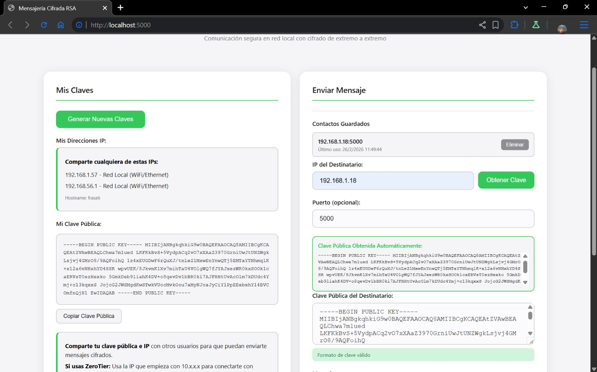
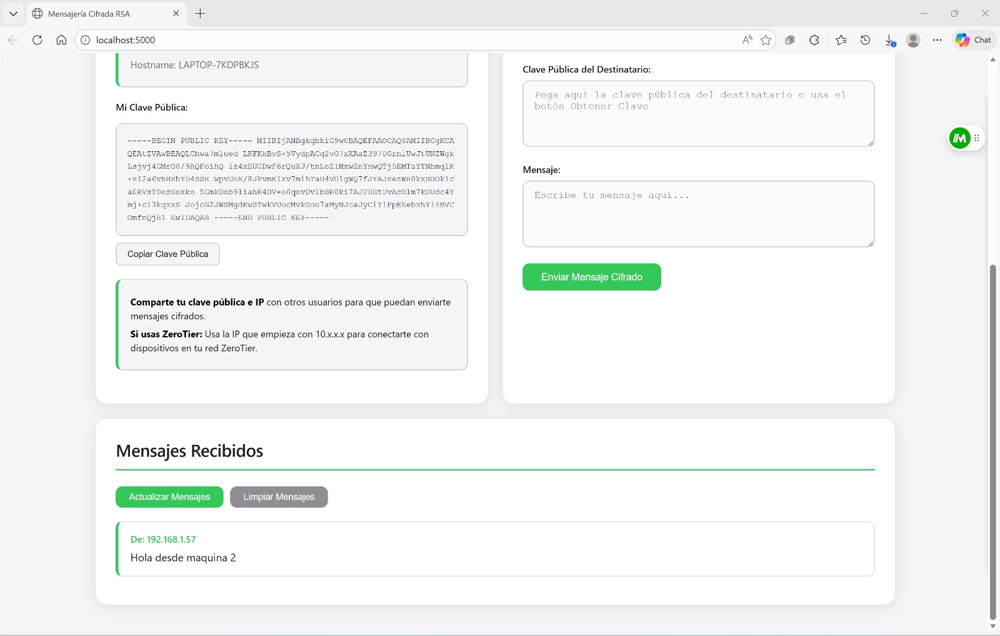
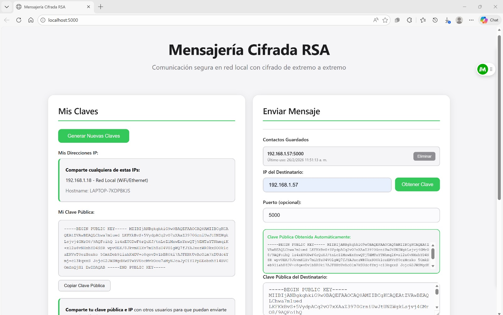
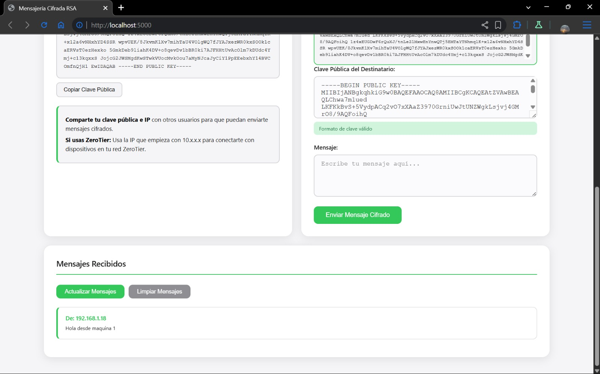

# Informe Técnico - Sistema de Mensajería Cifrada RSA

Sistema de mensajería cifrada implementado en Python que permite comunicación segura entre dispositivos en una red local mediante cifrado asimétrico RSA de 2048 bits con interfaz web.

**Tecnologías:** Python 3, Flask, Flask-CORS, Cryptography, JavaScript, HTML/CSS

---

## 1. Arquitectura del Sistema

### 1.1 Clase CryptoManager (crypto_utils.py)

Clase que encapsula todas las operaciones criptográficas del sistema utilizando la librería `cryptography`.

**Atributos:**
- `private_key`: Almacena la clave privada RSA
- `public_key`: Almacena la clave pública RSA

**Métodos principales:**

#### generate_keys()
```python
def generate_keys(self):
    self.private_key = rsa.generate_private_key(
        public_exponent=65537,
        key_size=2048,
        backend=default_backend()
    )
    self.public_key = self.private_key.public_key()
    return self.get_public_key_string()
```

Este método genera un par de claves RSA asimétricas utilizando el algoritmo de la librería cryptography sobre OpenSSL. Se especifica un exponente público de 65537, que es un valor estándar conocido como F4 de Fermat y ofrece un equilibrio óptimo entre seguridad y eficiencia computacional. El tamaño de clave de 2048 bits proporciona un nivel de seguridad equivalente a 112 bits simétricos, considerado seguro según estándares actuales. Una vez generada la clave privada mediante `rsa.generate_private_key()`, se deriva matemáticamente la clave pública correspondiente usando el método `public_key()`, garantizando la relación criptográfica entre ambas claves. Finalmente, retorna la clave pública serializada en formato PEM para compartir con otros usuarios.

#### encrypt_message(message, public_key_pem)
```python
def encrypt_message(self, message, public_key_pem):
    try:
        cleaned_key = self.clean_public_key(public_key_pem)
    except ValueError as e:
        raise ValueError(f"Error en formato de clave pública: {str(e)}")

    try:
        public_key = serialization.load_pem_public_key(
            cleaned_key.encode('utf-8'),
            backend=default_backend()
        )
    except Exception as e:
        raise ValueError(f"No se pudo cargar la clave pública. Error: {str(e)}")

    encrypted = public_key.encrypt(
        message.encode('utf-8'),
        padding.OAEP(
            mgf=padding.MGF1(algorithm=hashes.SHA256()),
            algorithm=hashes.SHA256(),
            label=None
        )
    )

    return base64.b64encode(encrypted).decode('utf-8')
```

Este método implementa el proceso de cifrado RSA recibiendo el mensaje en texto plano y la clave pública del destinatario en formato PEM. Primero valida y normaliza la clave pública mediante `clean_public_key()`, que elimina espacios, normaliza saltos de línea y verifica la presencia de los delimitadores PEM estándar. Luego deserializa la clave desde el formato PEM usando `load_pem_public_key()` de la librería cryptography. El cifrado se realiza aplicando padding OAEP (Optimal Asymmetric Encryption Padding) que añade aleatoriedad al mensaje antes de cifrarlo, utilizando SHA-256 como función hash y MGF1 como función de generación de máscara, lo que previene ataques criptográficos conocidos como el ataque de texto cifrado elegido. El mensaje cifrado resultante se codifica en Base64 para facilitar su transmisión a través de HTTP, ya que Base64 convierte datos binarios en caracteres ASCII imprimibles.

#### decrypt_message(encrypted_message_b64)
```python
def decrypt_message(self, encrypted_message_b64):
    if not self.private_key:
        raise ValueError("No se ha generado una clave privada")

    encrypted = base64.b64decode(encrypted_message_b64)

    decrypted = self.private_key.decrypt(
        encrypted,
        padding.OAEP(
            mgf=padding.MGF1(algorithm=hashes.SHA256()),
            algorithm=hashes.SHA256(),
            label=None
        )
    )

    return decrypted.decode('utf-8')
```

Este método realiza el proceso inverso de descifrado utilizando la clave privada almacenada localmente. Primero verifica que exista una clave privada cargada, ya que sin ella es imposible descifrar mensajes. Decodifica el mensaje cifrado desde Base64 a bytes binarios, revirtiendo la codificación aplicada durante el cifrado. Utiliza el método `decrypt()` de la clave privada con el mismo esquema de padding OAEP y parámetros (SHA-256 y MGF1) que se usaron durante el cifrado, lo cual es crítico para que el descifrado sea exitoso. El padding OAEP no solo elimina la aleatoriedad añadida sino que también valida la integridad del mensaje, detectando cualquier modificación o corrupción durante la transmisión. Finalmente, decodifica los bytes resultantes a una cadena UTF-8, recuperando el mensaje original en texto plano que envió el remitente.

#### save_keys() / load_keys()
```python
def save_keys(self, private_key_file='private_key.pem', public_key_file='public_key.pem'):
    if not self.private_key:
        raise ValueError("No se ha generado una clave privada")

    with open(private_key_file, 'wb') as f:
        pem = self.private_key.private_bytes(
            encoding=serialization.Encoding.PEM,
            format=serialization.PrivateFormat.PKCS8,
            encryption_algorithm=serialization.NoEncryption()
        )
        f.write(pem)

    with open(public_key_file, 'wb') as f:
        pem = self.public_key.public_bytes(
            encoding=serialization.Encoding.PEM,
            format=serialization.PublicFormat.SubjectPublicKeyInfo
        )
        f.write(pem)

def load_keys(self, private_key_file='private_key.pem'):
    with open(private_key_file, 'rb') as f:
        self.private_key = serialization.load_pem_private_key(
            f.read(),
            password=None,
            backend=default_backend()
        )
        self.public_key = self.private_key.public_key()
```

Estos métodos gestionan la persistencia de las claves RSA en el sistema de archivos local. El método `save_keys()` serializa ambas claves en formato PEM estándar, utilizando PKCS#8 para la clave privada y SubjectPublicKeyInfo para la pública, que son los formatos más ampliamente soportados en aplicaciones criptográficas. Las claves se escriben en archivos binarios sin cifrado adicional, lo que implica que la seguridad de la clave privada depende de los permisos del sistema operativo y la seguridad física del dispositivo. El método `load_keys()` realiza el proceso inverso, leyendo la clave privada desde el archivo PEM y deserializándola mediante `load_pem_private_key()`, especificando que no tiene contraseña de protección. Una vez cargada la clave privada, deriva automáticamente la clave pública correspondiente, garantizando que ambas claves mantengan su relación matemática correcta y evitando inconsistencias que podrían surgir si se cargaran desde archivos separados de manera independiente.

---

### 1.2 Aplicación Flask (app.py)

Servidor web que expone endpoints REST para la gestión de mensajería cifrada.

**Variables globales:**
- `crypto_manager`: Instancia de CryptoManager
- `messages`: Array que almacena mensajes recibidos
- `PORT`: Puerto de escucha (5000)

**Configuración CORS:**
```python
from flask_cors import CORS
app = Flask(__name__)
CORS(app)
```

La configuración CORS (Cross-Origin Resource Sharing) es esencial para permitir que navegadores web realicen peticiones HTTP entre diferentes orígenes (IPs distintas). Sin esta configuración, los navegadores modernos bloquean por seguridad las peticiones JavaScript desde `http://192.168.1.100:5000` hacia `http://192.168.1.101:5000`, impidiendo que la aplicación obtenga claves públicas automáticamente de otros servidores. Flask-CORS agrega los headers HTTP necesarios (`Access-Control-Allow-Origin: *`) que autorizan al navegador a realizar estas peticiones cross-origin, permitiendo la arquitectura descentralizada donde cada dispositivo ejecuta su propia instancia del servidor.

**Endpoints implementados:**

#### POST /api/generate-keys
```python
@app.route('/api/generate-keys', methods=['POST'])
def generate_keys():
    try:
        public_key = crypto_manager.generate_keys()
        crypto_manager.save_keys()
        return jsonify({
            'success': True,
            'public_key': public_key
        })
    except Exception as e:
        return jsonify({
            'success': False,
            'error': str(e)
        }), 500
```

Este endpoint inicia el proceso de generación de claves RSA cuando el usuario hace clic en el botón correspondiente en la interfaz web. Invoca el método `generate_keys()` de la instancia global `crypto_manager`, que crea el par de claves asimétricas de 2048 bits. Inmediatamente después persiste ambas claves en disco mediante `save_keys()`, garantizando que las claves se conserven incluso si la aplicación se reinicia. Retorna la clave pública en formato JSON para que la interfaz web la muestre al usuario, quien puede copiarla y compartirla con otros. El manejo de excepciones captura cualquier error durante la generación o guardado y retorna un código HTTP 500 con el mensaje de error, permitiendo que el frontend notifique al usuario del problema específico.

#### GET /api/get-public-key
```python
@app.route('/api/get-public-key', methods=['GET'])
def get_public_key():
    try:
        if crypto_manager.public_key:
            public_key = crypto_manager.get_public_key_string()
        else:
            if os.path.exists('private_key.pem'):
                crypto_manager.load_keys()
                public_key = crypto_manager.get_public_key_string()
            else:
                return jsonify({
                    'success': False,
                    'error': 'No hay claves generadas'
                }), 400

        return jsonify({
            'success': True,
            'public_key': public_key
        })
    except Exception as e:
        return jsonify({
            'success': False,
            'error': str(e)
        }), 500
```

Este endpoint es crucial para el flujo de comunicación ya que permite que otros dispositivos obtengan la clave pública de este servidor sin intervención manual del usuario. Primero verifica si ya existe una clave pública en memoria, lo cual es eficiente para peticiones subsecuentes. Si no existe en memoria pero hay un archivo `private_key.pem` en disco, carga las claves desde el archivo, permitiendo que el servidor retome su operación después de un reinicio sin requerir regenerar las claves. Si no existen claves en absoluto, retorna un error HTTP 400 indicando que el usuario debe generar claves primero. Este diseño lazy-loading optimiza el uso de recursos mientras mantiene la disponibilidad automática de la clave pública para otros dispositivos que deseen enviar mensajes cifrados a este servidor.

#### POST /api/send-message
```python
@app.route('/api/send-message', methods=['POST'])
def send_message():
    try:
        data = request.json
        message = data.get('message')
        recipient_ip = data.get('recipient_ip')
        recipient_port = data.get('recipient_port', PORT)
        recipient_public_key = data.get('recipient_public_key')

        if not all([message, recipient_ip, recipient_public_key]):
            return jsonify({
                'success': False,
                'error': 'Faltan datos requeridos'
            }), 400

        encrypted_message = crypto_manager.encrypt_message(message, recipient_public_key)

        url = f'http://{recipient_ip}:{recipient_port}/api/receive-message'
        response = requests.post(url, json={
            'encrypted_message': encrypted_message
        }, timeout=5)

        if response.status_code == 200:
            return jsonify({
                'success': True,
                'message': 'Mensaje enviado correctamente'
            })
        else:
            return jsonify({
                'success': False,
                'error': 'Error al enviar el mensaje'
            }), 500

    except requests.exceptions.RequestException as e:
        return jsonify({
            'success': False,
            'error': f'Error de conexión: {str(e)}'
        }), 500
    except Exception as e:
        return jsonify({
            'success': False,
            'error': str(e)
        }), 500
```

Este endpoint orquesta el proceso completo de envío de mensajes cifrados entre dos dispositivos. Recibe del cliente web el mensaje en texto plano, la IP del destinatario, el puerto (por defecto 5000) y la clave pública del destinatario previamente obtenida. Valida que todos los campos requeridos estén presentes para evitar errores durante el cifrado. Invoca `encrypt_message()` del `crypto_manager` para cifrar el mensaje usando la clave pública del destinatario, produciendo el texto cifrado en Base64. Luego actúa como cliente HTTP realizando una petición POST al servidor Flask del destinatario en `http://recipient_ip:port/api/receive-message`, transmitiendo el mensaje cifrado. El timeout de 5 segundos previene bloqueos indefinidos si el destinatario no está disponible. El manejo de excepciones diferencia entre errores de conexión de red (usando `RequestException`) y otros errores, permitiendo mensajes de error específicos que ayudan al usuario a diagnosticar problemas de conectividad versus problemas criptográficos.

#### POST /api/receive-message
```python
@app.route('/api/receive-message', methods=['POST'])
def receive_message():
    try:
        data = request.json
        encrypted_message = data.get('encrypted_message')

        if not encrypted_message:
            return jsonify({
                'success': False,
                'error': 'No se recibió el mensaje'
            }), 400

        if not crypto_manager.private_key:
            if os.path.exists('private_key.pem'):
                crypto_manager.load_keys()
            else:
                return jsonify({
                    'success': False,
                    'error': 'No hay claves para descifrar'
                }), 400

        decrypted_message = crypto_manager.decrypt_message(encrypted_message)

        messages.append({
            'message': decrypted_message,
            'from_ip': request.remote_addr
        })

        return jsonify({
            'success': True,
            'message': 'Mensaje recibido y descifrado'
        })

    except Exception as e:
        return jsonify({
            'success': False,
            'error': f'Error al descifrar: {str(e)}'
        }), 500
```

Este endpoint recibe mensajes cifrados provenientes de otros servidores Flask y los descifra usando la clave privada local. Primero extrae el mensaje cifrado del payload JSON y valida su presencia. Verifica que exista una clave privada en memoria, y si no, intenta cargarla desde `private_key.pem`, implementando el mismo patrón lazy-loading que el endpoint de obtención de clave pública. Invoca `decrypt_message()` del `crypto_manager` para descifrar el mensaje usando la clave privada local y el padding OAEP, recuperando el texto plano original. Almacena el mensaje descifrado en el array global `messages` junto con la dirección IP del remitente obtenida de `request.remote_addr`, permitiendo que la interfaz web identifique quién envió cada mensaje. Retorna una confirmación JSON indicando que el mensaje fue recibido y descifrado exitosamente, completando el flujo de comunicación cifrada entre dos dispositivos. El manejo de excepciones captura errores de descifrado que podrían ocurrir si el mensaje fue cifrado con una clave pública diferente o si los datos se corrompieron durante la transmisión.

---

## 2. Explicación del Cifrado RSA

### 2.1 Fundamentos Teóricos

RSA es un algoritmo de cifrado asimétrico basado en la dificultad de factorizar números primos grandes. Utiliza dos claves matemáticamente relacionadas:
- Clave pública (n, e): Para cifrar mensajes
- Clave privada (n, d): Para descifrar mensajes

Donde:
- n: Módulo RSA (producto de dos primos grandes p y q)
- e: Exponente público (65537 en esta implementación)
- d: Exponente privado (calculado mediante el algoritmo extendido de Euclides)

**Operaciones matemáticas:**
- Cifrado: C = M^e mod n
- Descifrado: M = C^d mod n

### 2.2 Implementación en el Proyecto

**Generación de claves:**
La librería `cryptography` implementa el algoritmo RSA utilizando OpenSSL. Al generar claves de 2048 bits, se crean dos números primos aleatorios de aproximadamente 1024 bits cada uno. El exponente público 65537 es un valor estándar que optimiza las operaciones de cifrado.

**Padding OAEP:**
Para evitar vulnerabilidades criptográficas, se aplica OAEP (Optimal Asymmetric Encryption Padding) que:
1. Añade aleatoriedad al mensaje antes de cifrar
2. Utiliza SHA-256 como función hash
3. Aplica MGF1 (Mask Generation Function) para generar máscaras pseudoaleatorias
4. Previene ataques de texto cifrado elegido y texto plano conocido

**Limitaciones de tamaño:**
RSA 2048 con OAEP/SHA-256 puede cifrar máximo 190 bytes por operación.
Cálculo: (2048/8) - 2*32 - 2 = 190 bytes
Mensajes mayores requerirían cifrado híbrido (RSA + AES), no implementado en este proyecto.

### 2.3 Flujo de Comunicación en la Aplicación

El sistema implementa el flujo RSA clásico adaptado a una arquitectura cliente-servidor HTTP:

1. **Generación de claves:** Cada instancia ejecuta `python app.py` y genera su par de claves RSA mediante `/api/generate-keys`. La clave privada se almacena en `private_key.pem` (nunca se transmite) y la pública en `public_key.pem`.

2. **Intercambio de claves públicas:** Cuando el Usuario A desea enviar un mensaje al Usuario B, su navegador realiza una petición `GET` a `http://IP_B:5000/api/get-public-key` para obtener la clave pública de B. Este endpoint retorna la clave en formato PEM.

3. **Cifrado del mensaje:** El navegador de A ejecuta JavaScript que llama al servidor local Flask de A mediante `POST /api/send-message`. El servidor A utiliza `CryptoManager.encrypt_message()` que:
   - Carga la clave pública de B desde el string PEM
   - Codifica el mensaje en bytes UTF-8
   - Aplica padding OAEP con SHA-256
   - Cifra usando el algoritmo RSA: C = M^e mod n
   - Codifica el resultado en Base64

4. **Transmisión del mensaje cifrado:** El servidor Flask A envía el mensaje cifrado mediante `POST` a `http://IP_B:5000/api/receive-message` con el payload `{encrypted_message: "base64_data"}`.

5. **Recepción y descifrado:** El servidor Flask B recibe la petición y ejecuta `CryptoManager.decrypt_message()` que:
   - Decodifica el mensaje desde Base64
   - Carga su clave privada desde `private_key.pem`
   - Descifra usando: M = C^d mod n
   - Valida y elimina el padding OAEP
   - Retorna el texto plano original

6. **Visualización:** El mensaje descifrado se almacena en el array `messages` junto con la IP de origen y se muestra automáticamente en la interfaz web de B.

**Seguridad del flujo:**
- La clave privada nunca abandona el dispositivo de origen
- Cada mensaje se cifra con la clave pública específica del destinatario
- Solo el destinatario con la clave privada correspondiente puede descifrar
- El padding OAEP añade aleatoriedad, haciendo que el mismo mensaje cifrado dos veces produzca resultados diferentes

**Gestión de contactos:**
La aplicación implementa un sistema de caché de claves públicas usando LocalStorage del navegador. Cuando se obtiene una clave pública, se almacena con formato `{ip, port, publicKey, lastUsed}`, permitiendo reutilización sin solicitar la clave nuevamente.

---

## 3. Evidencias de Implementación









